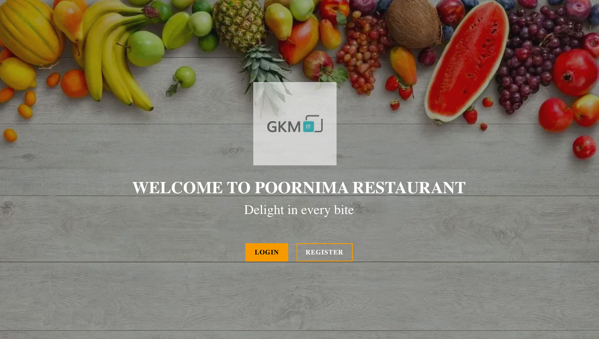
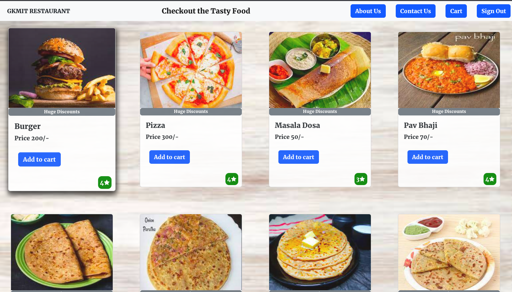
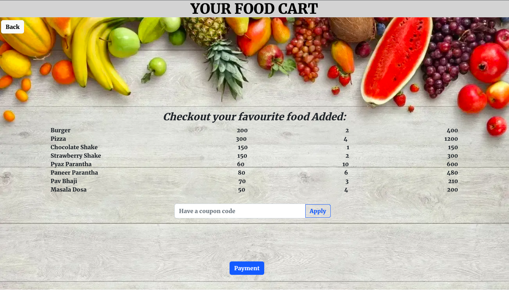
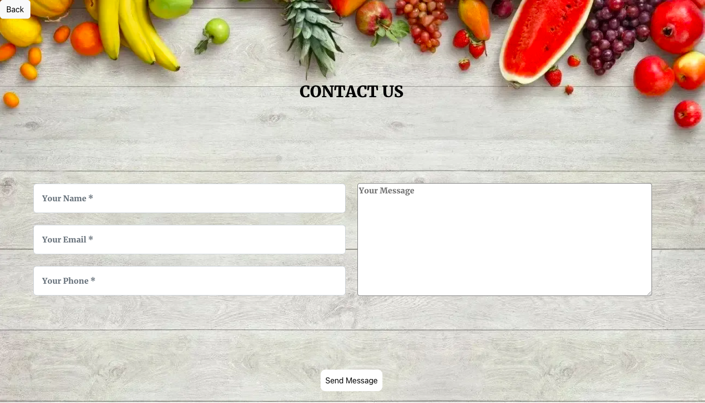

🍽️ GKMIT Restaurant
A full-stack MERN application where users can explore, order, and enjoy delicious meals online.

📸 Screenshots

Home Page :-

Food Page :-

Cart Page :-

Contact Us Page :-

🚀 Live Demo
👉 Click here to try the live demo -> https://restaurant-frontend-5teja4ug1-himanshur25.vercel.app/

🛠️ Tech Stack
Frontend:

ReactJS

Advanced CSS

Backend:

Node.js

Deployment:

Vercel (Frontend)

Heroku (Backend)

📸 Screenshots
🏠 Home Page

🍔 Food Page

🛒 Cart Page

📞 Contact Us Page

🔑 Features
🍱 Browse delicious food items

➕ Add items to cart

🧾 View and manage your cart

📞 Contact restaurant for queries

